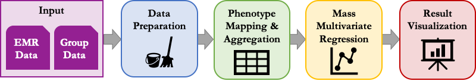

Getting Started
===============

Installation
------------

pyPheWAS is compatible with Python 3. Install the pyPheWAS package by running::

		pip install pyPheWAS

If this command fails, make sure that you are running Python 3+ and that you have
pip set up on your machine.

* `python3 <https://wiki.python.org/moin/BeginnersGuide/Download>`_ installation
* `pip <https://pip.pypa.io/en/stable/installing/>`_ installation
  *(should be installed automatically with python3)*

The pyPheWAS command line tools can now be run from any directory.

.. note:: If installing on a computing cluster (or other environment in which you do not have admin privileges) it may necessary to install pyPheWAS locally using pip's *--user* flag.

.. note:: pyPheWAS was originally developed in python2, and may still be compatible.
    However, the most recent releases have not been tested against python2.

What is PheWAS?
---------------

**PheWAS**:  Phenome-Wide Association Studies

In brief, PheWAS examine the relationship between a large number of Electronic
Medical Record (EMR) phenotypes and a single dependent variable, typically
a genetic marker (see note). These studies, which were first proposed by Denny et al
in 2010 [Denny2010]_, are a complement of the popular Genome-Wide Association Study
(GWAS) framework, which compares many genetic markers to a single clinical phenotype.

An overview of the PheWAS workflow is shown below. The pyPheWAS package covers
all steps in the pipeline for two types of EMR data: International Classification
of Disease (ICD) codes and Current Procedural Terminology (CPT) codes. To
differentiate the two, studies of ICD codes are referred
to as **PheWAS**, while studies of CPT codes are referred to as **ProWAS**.

* **Input files** consist of group demographic data and EMR event data. These files
  are described in detail under :ref:`File Formats`.
* The **Data Preparation** phase includes converting EMR event dates to subject ages,
  case-control matching, censoring events, etc. These tools are covered in the
  :ref:`Data Preparation` section.
* In the **Phenotype Mapping & Aggregation** phase, individual EMR events are mapped
  to their corresponding phenotypes and aggregated across each subject's record.
  This phase is described in :ref:`pyPhewasLookup` for ICD data and
  :ref:`pyProwasLookup` for CPT data. (Details regarding the phenotype mappings
  used for ICD/CPT codes are included in these sections.)
* In the **Mass Multivariate Regression** phase, a mass logistic regression is performed
  across the Phenome, comparing the dependent variable with each aggregated phenotype and
  any provided covariates. This phase is described in :ref:`pyPhewasModel` for ICD data and
  :ref:`pyProwasModel` for CPT data.
* Finally, the **Result Visualization** phase generates plots of the mass
  regression results, comparing statistical significance and effect size across
  the Phenome. This phase is described in :ref:`pyPhewasPlot` for ICD data and
  :ref:`pyProwasPlot` for CPT data.

.. note:: pyPheWAS tools are agnostic to the dependent regression variable, so long as
  it is a binary quantity. Due to this, pyPheWAS may be used to study diseases
  instead of traditional genetic markers. In order to avoid confusion with the
  genetic roots of the term PheWAS, studies
  such as this are referred to as *Phenome-Disease Association Studies* (PheDAS)
  [Chaganti2019a]_.

Phenotype Aggregation
---------------------
There are three phenotype aggregation options for the :ref:`pyPhewasLookup`
and :ref:`pyProwasLookup` tools.

 1. **log**: binary aggregates (Is a phenotype present/absent for a subject?)
 2. **lin**: count aggregates (How many times is a phenotype present for a subject?)
 3. **dur**: duration aggregates (What is the time interval [years] between the first
    and last instances of a phenotype for a subject?)

File Formats
------------
All tools described in :ref:`Data Preparation`, :ref:`PheWAS Tools`, and
:ref:`ProWAS tools` require EMR data contained in a phenotype file and/or group
file. The formats of these files are described below.

Phenotype File (ICD data)
^^^^^^^^^^^^^^^^^^^^^^^^^
The PheWAS phenotype file format is shown below; this phenotype file
contains ICD event data for each subject in the group file, with one event per line.
All ages are in years. If your ICD event records were provided with dates instead
of ages, *AgeAtICD* may be calculated using the :ref:`convertEventToAge` tool.
*ICD_TYPE* is restricted to the values *9* and *10*.

==== ======== ======== ========
id   ICD_CODE ICD_TYPE AgeAtICD
==== ======== ======== ========
11   790.29   9        10.4
11   580.8    9        11.5
131  A03.2    10       60.0
9999 740.2    9        0.2
==== ======== ======== ========

Phenotype File (CPT data)
^^^^^^^^^^^^^^^^^^^^^^^^^
The ProWAS phenotype file format is shown below; this phenotype file
contains CPT event data for each subject in the group file, with one event per line.
All ages are in years. If your CPT event records were provided with dates instead
of ages, *AgeAtCPT* may be calculated using the :ref:`convertEventToAge` tool.

==== ======== ========
id   CPT_CODE AgeAtCPT
==== ======== ========
A52   790.29   10.4
A76   580.8    11.5
B01   A03.2    60.0
B21   740.2    0.2
==== ======== ========

Group File
^^^^^^^^^^
The group file format is shown below; this file contains the dependent variable
(in this example, *response*) for the mass logistic regression, in addition to demographic information
(e.g. sex, race, age at diagnosis, etc.) for each subject.

===== ======== ============= ==================
id    response MaxAgeAtVisit *other covariates*
===== ======== ============= ==================
1     0        10.365         ...
32    0        15.444         ...
131   1        13.756         ...
200   0        12.887         ...
===== ======== ============= ==================

By default, the PheWAS and ProWAS tools use the **genotype** column as the dependent variable, but
any column in the group file may be specified as the dependent variable via the
``response`` argument so long as the column contains only the values 0 and 1.

*MaxAgeAtVisit* is the maximum recorded event age for each subject; this column is optional.
If not provided, it will be calculated at runtime from the phenotype data provided. This
column is used to generate a maximum age covariate feature matrix, which records the
maximum age of each subject at each PheCode/ProCode; *MaxAgeAtVisit* is used as the default
value for PheCodes/ProCodes not in the subject's record.
