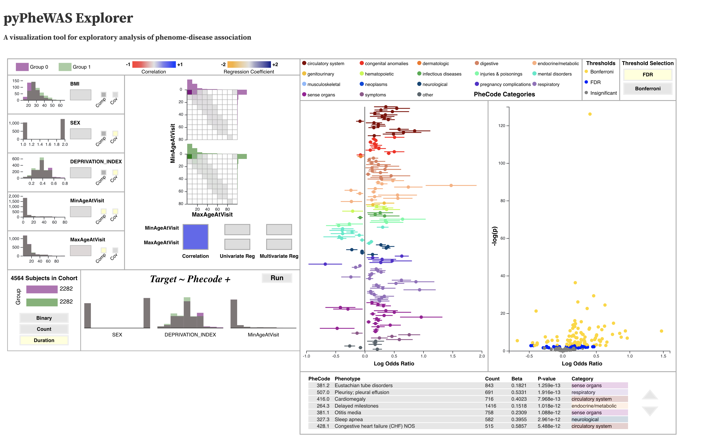

pyPheWAS Explorer
=================
This section describes pyPheWAS Explorer: an interactive visualization built
on top of pyPheWAS. This graphical tool allows users to examine group variables,
design PheDAS models, and run exploratory PheDAS analyses in real time.

.. toctree::
   :maxdepth: 1

   explorer_setup
   explorer_walkthrough

