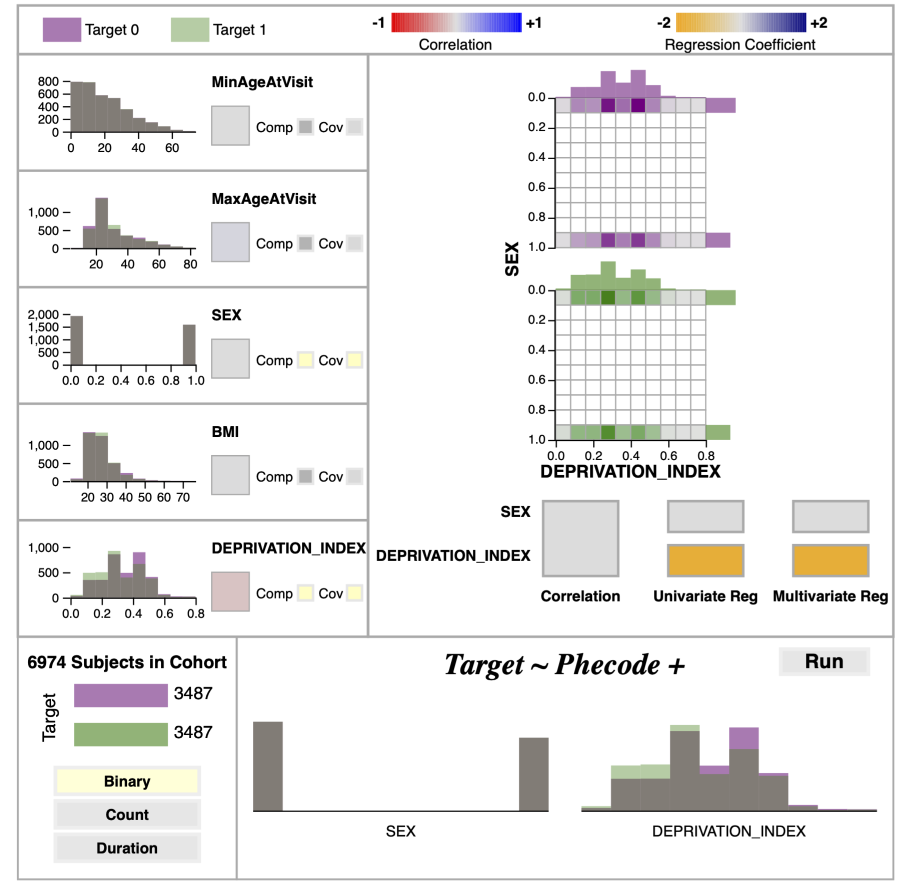
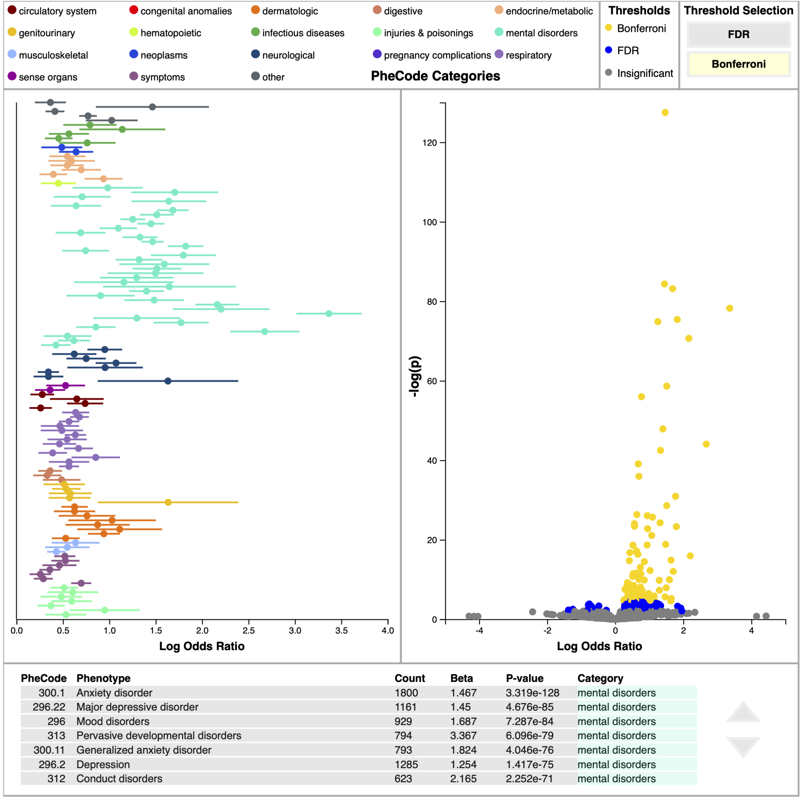

pyPheWAS Explorer Walkthrough
=============================

On launch, the Explorer loads all data and performs some preprocessing steps. The
first time it is launched on a new dataset, it must build binary, count, and duration
feature matrices as described in :ref:`pyPhewasLookup`. These feature matrices
are saved in the working directory so they may be re-loaded for faster startup
on subsequent launches.

The Explorer is made up of two primary panels: the *Regression Builder* panel and the
*Regression Evaluation* panel. Descriptions for both are below.

------------------------

Regression Builder Panel
------------------------

The Regression Builder panel provides three important functions for the user:

1) examine compact summaries of individual group variables;
2) consider the joint distribution and statistical relationship of two group variables;
3) design and run PheDAS models.

Individual Variable Summaries
^^^^^^^^^^^^^^^^^^^^^^^^^^^^^
In the individual variable views, the distribution of each variable for both the disease group and the
control group is shown via overlapping histograms. Bin size was constrained to be identical
between the two groups to make comparison easier. Additionally, the bins were made to be partially
transparent to prevent overlapping bins from obscuring the distributions. To complement this view, the
individual variable section also includes a colored block which denotes the correlation coefficient between
the group variable and the target disease via its face color. Together, the distributions and correlation
coefficients are intended to give the user a good first impression of all variables.

Variable Comparison View
^^^^^^^^^^^^^^^^^^^^^^^^
The variable comparison view (VCV) is activated by selecting two variables via the “Comp” button
in the individual variables’ summary blocks. The VCV features two types of comparison: joint distributions
and statistical comparison. Two joint histograms are shown for the selected variables, one for the disease group and one
for the control. Bins with no members are colored white, while bins with at least one member are colored
on a scale from gray to the group’s color (green for disease, purple for control) according to the number of
members in the bin. This coloring emphasizes where members are located in the distribution, immediately
drawing the user’s eye to the non-empty bins. To support more precise examination, hovering over the bins
displays their membership count at the upper right of the histogram.

The VCV’s statistical comparison section shows summary statistics as colored blocks below the joint
histograms. The first of these is the correlation coefficient between the variabless.
The second is a multicollinearity test, wherein the target variable is regressed as a function of each
variable individually and by both variables together. The coefficients calculated from these
regressions are then displayed as colored blocks for each variable. In general, if the two variables
are not correlated and their regression coefficients remain constant across the individual and
combined multicollinearity models, the independence assumption holds, and they may be safely
included in the PheDAS model together.

Model Designer
^^^^^^^^^^^^^^
The regression builder view contains two sections. The first section displays the target variable split in
the cohort and the selected regression type (Binary, Count, or Duration). Users can switch between
regression types by clicking on these buttons. The second section shows the group variables
selected to be covariates in the logistic regression. Covariates are selected by clicking on the “Cov” button
in the individual group variable summaries. Selected covariates are represented by both their name and histogram to visually
reinforce which variables have been selected. This panel also includes a “Run” button which triggers
the python backend to run the mass logistic regression model for all PheCodes given the regression type and
covariates chosen by the user; results from this model are then sent to the Regression Evaluation panel.
NB: PheDAS models generally take about 30 seconds to several minutes to run, depending on the cohort
size and local hardware.

---------------------------

Regression Evaluation Panel
---------------------------
The logistic regression model produces two statistics that describe the relationship between the target
disease and each PheCode: a beta value and a p-value. The beta value, or log odds ratio, describes the
strength of this relationship (specifically, it is the estimated increase in the log odds of the disease per unit
increase in the PheCode value). The p-value describes the statistical significance of the relationship. The
regression panel was designed with multiple views of these two important statistics to provide insight into these relationships.

Log Odds Plot
^^^^^^^^^^^^^
The log odds plot shows the beta value (along with its confidence interval) on the x-axis with PheCodes listed
down the y-axis. Only PheCodes that exceed a multiple comparisons correction significance level (either FDR
or Bonferroni) are included in this plot. The user can switch between FDR and Bonferroni via clicking on the
appropriately named button at the top of this panel. PheCodes are sorted into and colored by 18 unique
categories. This plot is advantageous for comparing effect sizes of different PheCodes, at-a
glance analysis of category prominence, and assessing sureness of fit for a PheCode based on confidence
intervals.

Volcano Plot
^^^^^^^^^^^^^
The volcano plot shares the same x-axis as the log odds plot, but shows significance on the y-axis via
the negative log of the p-value. The negative log is used instead of the raw p-value to emphasize significance;
low p-values are more significant than high p-values, so when it’s transformed by the negative log,
high values correspond to high significance. In this view, PheCodes are colored according to which multiple comparisons correction
significance threshold they exceed (insignificant, FDR, and Bonferroni). This view is a useful
summary of the model results and may be used as a starting point for deeper investigations, as users can see
interesting Phecode relationships in a single glance (e.g. PheCodes with high effect and high significance).

Data Table
^^^^^^^^^^
The data table explicitly lists the results of the logistic regression for each PheCode, including PheCode
number and name, the count number of subjects in the cohort presenting that PheCode, beta value, p-value, and category.
PheCodes are sorted according to ascending p-value, so that the most significant PheCodes are
listed at the top of the table.

Interactions
^^^^^^^^^^^^
To increase coherence among these views, several interactions are available to the user. Hovering over
a PheCode on either the volcano or log odds plots displays the PheCode’s name. Clicking on a PheCode in
either plot highlights the PheCode in both plots, pins the name of PheCode to the plot, and highlights the
PheCode’s row in the table (if visible). Finally, selecting a PheCode from the data table highlights that PheCode
in both plot views. Clicking on either plot’s background clears plot highlighting.
