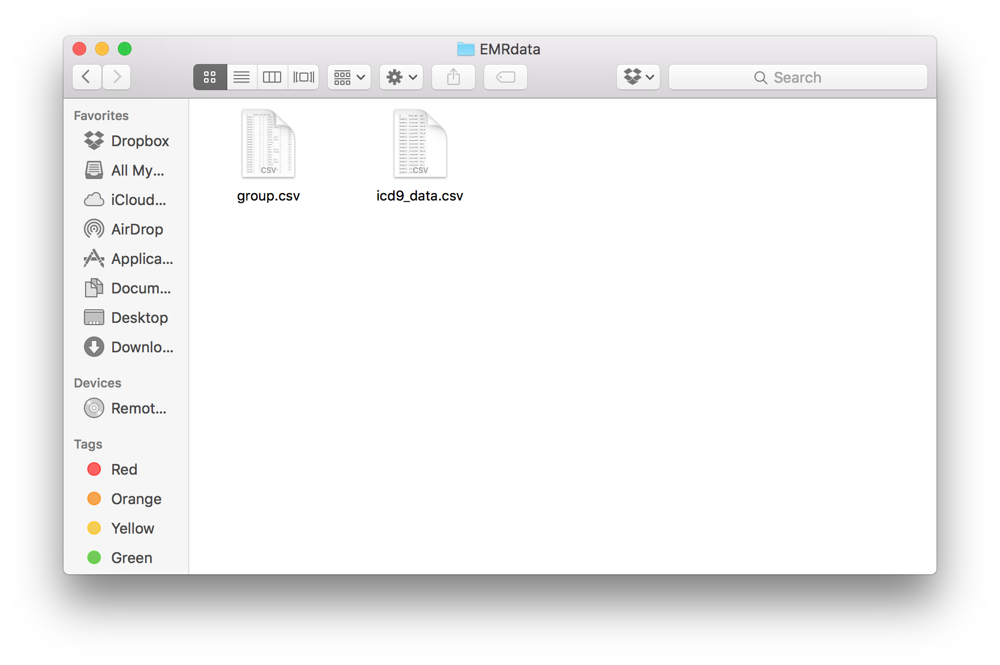
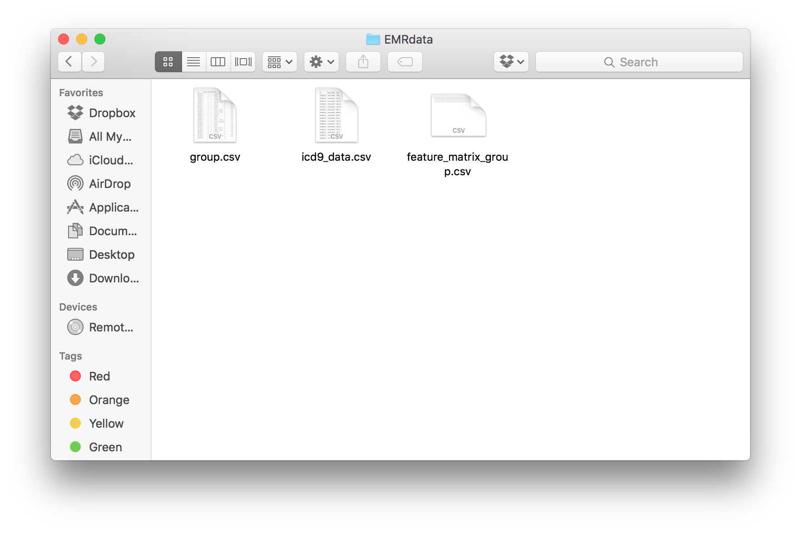
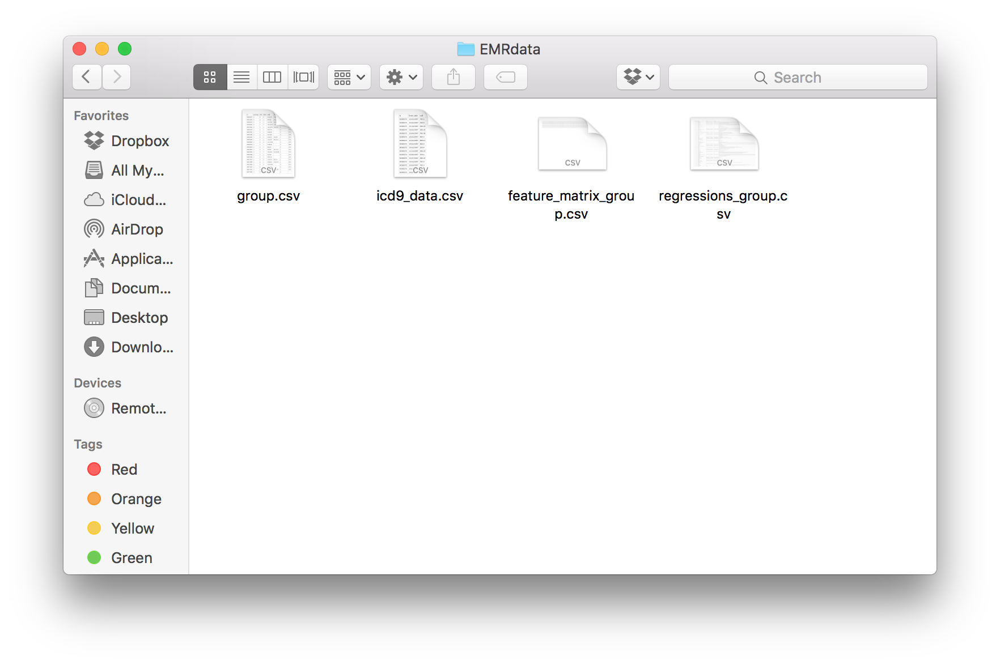
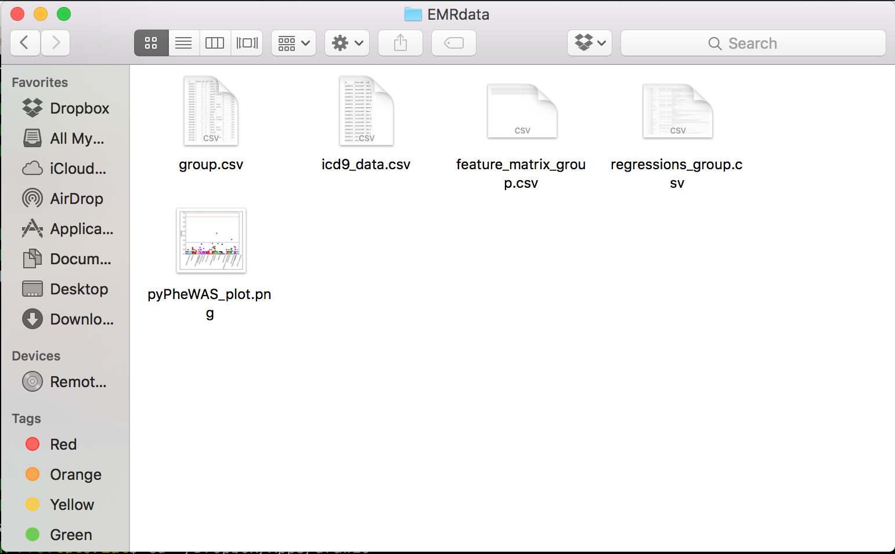

Research Tools
==============

Using pyPheWAS Research Tools
-----------------------------

The pyPheWAS Research Tools have 3 primary phases. However, age matching and censoring tools exist to change the data beforehand depending on your desired output. The other phases are the Lookup, Model, and Plot phases.

* pyPhewasLookup: generates a feature matrix from the icd9, group data, and type of regression.
* pyPhewasModel: runs the regressions from the feature matrix and outputs a large set of statistical data.
* pyPhewasPlot: this step plots the data from the regressions file.

This is a basic outline of the pyPheWAS research tools structure:

.. figure:: pyPheWAS_Research_Tools.png

Getting Started
---------------

Install the pyPheWAS package by running::

		pip install pyPheWAS

If this command fails, make sure that you are running Python 2.7+ and that you have pip set up on your machine.

As long as the install is successful, the pyPheWAS package can now be run from any directory.

pyPhewasLookup
--------------
 
pyPhewasLookup takes the phenotype file and the group file and will generate the feature matrix.

The options:
 * ``--path``:		the path to all input files and destination of output files
 * ``--phenotype``:	the name of the phenotype file (e.g. "icd9_data.csv")
 * ``--group``:		the name of the group file (e.g. "groups.csv")
 * ``--outfile``:	the name of the output file that contains the feature matrix
 * ``--reg_type``: the type of regression that you would like to use. (See the key below for more information)

.. note:: the outfile parameter is not required. If it is left off, the default output file will be "feature_matrix_[group file name]" So if "group.csv" is entered as the group file and the outfile parameter is not specified, the feature matrix will be placed in "feature_matrix_group.csv"

The valid options for reg_type:
 * log: logarithmic regression
 * lin: linear regression
 * dur: linear regression on the duration of diseases

A sample execution of *pyPhewasLookup*::

		pyPhewasLookup --path="/Users/me/Documents/EMRdata/" --phenotype="icd9_data.csv" --group="group.csv" --reg_type="log" --outfile="feature_matrix_group.csv"

The "EMRdata" folder before the command:

After the command:

pyPhewasModel
-------------

pyPhewasModel takes the feature matrix, group file, covariate information, and regression type and runs regressions on each PheWAS code to test for association.

The options:
 * ``--path``:			the path to all input files and destination of output files
 * ``--feature_matrix``:the name of the feature matrix file (e.g. "feature_matrix_group.csv")
 * ``--group``:			the name of the group file (e.g. " group.csv")
 * ``--covariates``:	the variables to be used as covariates
 * ``--reg_type``:		the regression type to be used (e.g. "log")
 * ``--outfile``:		the name of the output file that contains the regression data
The valid regression types are listed above under *pyPhewasLookup*

.. note:: the outfile parameter is not required. If it is left off, the default output file will be "regressions_[group file name]" So if "group.csv" is entered as the group file and the outfile parameter is not specified, the feature matrix will be placed in "regressions_group.csv"

.. note:: If multiple covariates are to be used, it is necessary to specify them in one string with a *+* in between them. For example, if you would like to use "genotype" and "age" as covariates, the argument would be ``--covariates="genotype+age"``

A sample execution of *pyPhewasModel*::

		pyPhewasModel --path="/Users/me/Documents/EMRdata/" --feature_matrix="feature_matrix_group.csv" --group="group.csv" --covariates="genotype" --reg_type="log" --outfile="regressions_group.csv"

The "EMRdata" folder before the command:

.. figure:: pyPhewasModelBefore.png

After the command:

pyPhewasPlot
------------

pyPhewasPlot takes the statistics file and threshold type and generates a plot based on the regression data.

The options:
 * ``--path``:			the path to all input files and destination of output files
 * ``--statfile``:		the name of the statistics file
 * ``--imbalance``:		the option of whether or not to show the direction of imbalance in the plot
 * ``--thresh_type``:	the type of threshold to be used in the plot (See the key below for more information)
 * ``--outfile``:		the name of the output file for the plot

.. note:: the outfile is not required. If it is left off, an output file will not be saved to the target directory. Instead, a plot will be displayed on the screen by the matplotlib module. It is possible to save the plot with any desired file name in this display.

.. note:: the ``--imbalance`` option must be either *True* or *False*

The valid options for thresh_type:
 * *bon*:	Use the Bonferroni correction threshold
 * *fdr*:	Use the False Discovery Rate threshold

A sample execution of *pyPhewasPlot*::

		pyPhewasPlot --path="/Users/me/Documents/EMRdata/" --statfile="regressions_group.csv" --imbalance="False" --thresh_type="bon" --outfile="pyPheWAS_plot.png"

The "EMRdata" folder before the command:

After the command:

Additional Research Tools
=========================

Grouping Tool (generateGroups)
-------------

The grouping tool allows you to take two or more icd9 files, and two or more group files. And merge them together, while removing any double counted groups, so that the resulting data files are ready to be run through the pyPheWAS Research Tools.

The options:
 * ``--path``:			the path to all input files and destination of output files
 * ``--phenotypefiles``:		a list of phenotype file names, each separated by a *+*
 * ``--groupfile``:				a list of group file names, each separated by a *+*
 * ``--phenotypeout``:			the output file name for the merged phenotype files
 * ``--groupout``:				the output file name for the merged group files

A sample execution of *generateGroups*::

		generateGroups --path="/Users/me/Documents/EMRdata" --phenotypefiles="icd9_one.csv+icd9_two.csv" --groupfiles="group_one.csv+group_two.csv" --phenotypeout="new_icd9.csv" --groupout="new_group.csv"

Conver event to age (convertEventToAge)
------------
Converts event date of ICD9 or CPT to age at the event. Phenotype and group files should be provided with “id” column in both files, and a “DOB” column in the group file.
The options:
 * ``--phenotype``: phenotype file name
 * ``--group``:	 group file name
 * ``--path``:	the path to all input files and destination of output files
 * ``--phenotypeout``:	the output file name for the merged phenotype files
 * ``--eventcolumn``:	Name of the event date column
 * ``-—precision``:	Decimal precision of the age needed
 * ``-—type``:	Type of data:CPT or ICD

Censoring (censorData)
---------

Censor files to restrict data to a specific time interval. The default field option is to censor based on AgeAtICD. Can change the default field to other events such as AgeAtDx. 
The options:
 * ``--path``:			the path to all input files and destination of output files
 * ``--phenotype``:		phenotype file name
 * ``--group``:			group file name
 * ``--field``:			the field is the type of event to censor on
 * ``-—phenotypeout``:		the output file name for the censored phenotype files
 * ``-—groupout``:		the output file name for the censored genotype files
 * ``-—start``:			start time for censoring
 * ``-—end``:			end time for censoring

A sample execution of *censorData*::

		censorData --path="/Users/me/Documents/EMRdata" --phenotype="icd9_data.csv" --group="group.csv" —field=“AgeAtDx” —-phenotypeout="icd9_data_cen.csv" —groupout="group_cen.csv" -—start="0" —-end="2"

